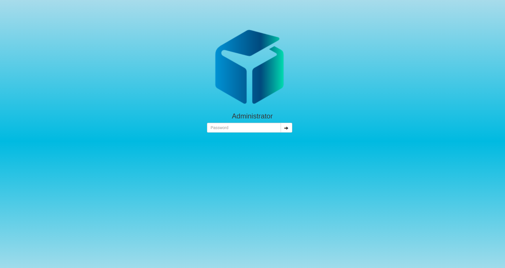
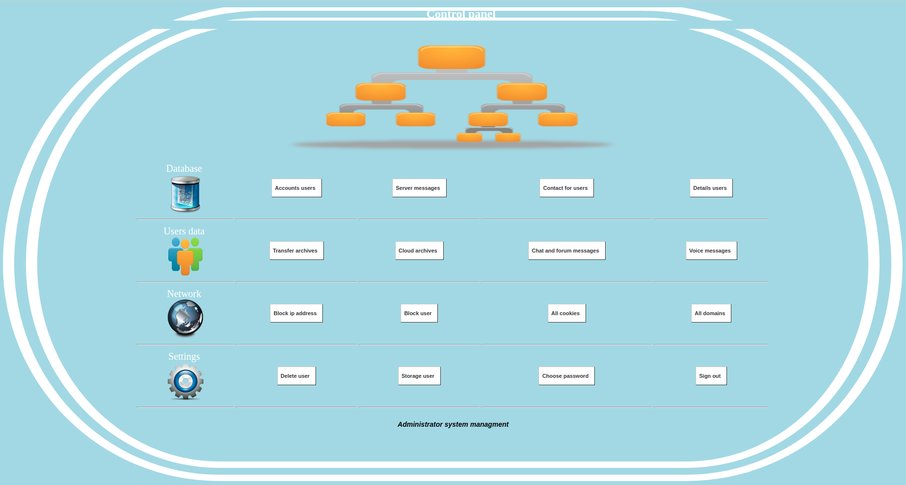

# control_panel
Makbox control panel for the cloud manager

1) Insert the folder control_panel into your cloud folder  
2) open a browser and type https:// or http:// localhost/control_panel  
3) Connect to the dashboard and manage your cloud data  
4) for connect to dashboard use: password:makbox  

   

  
